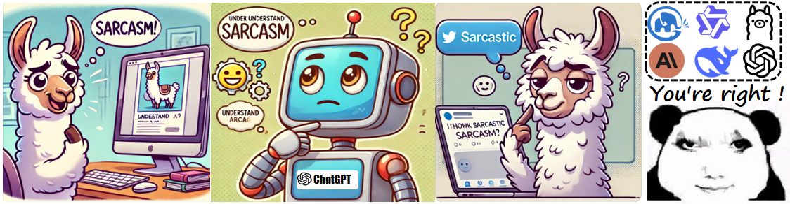
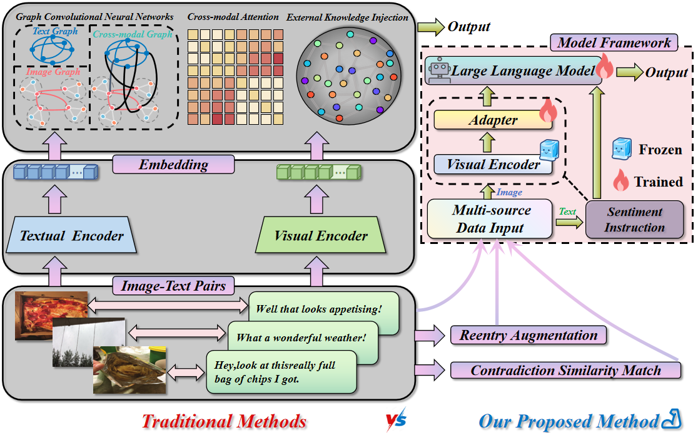
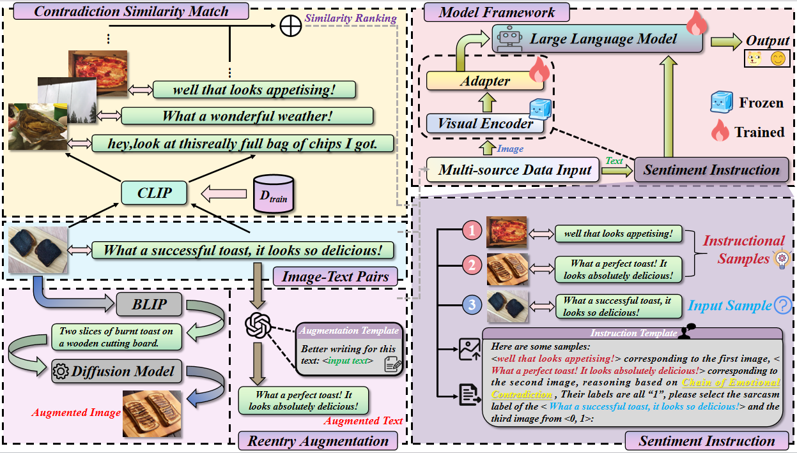
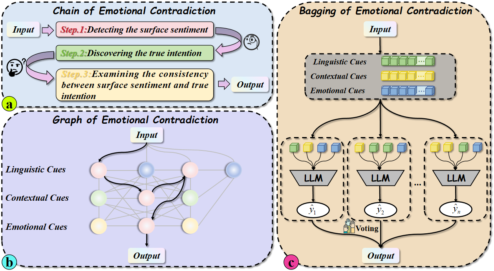
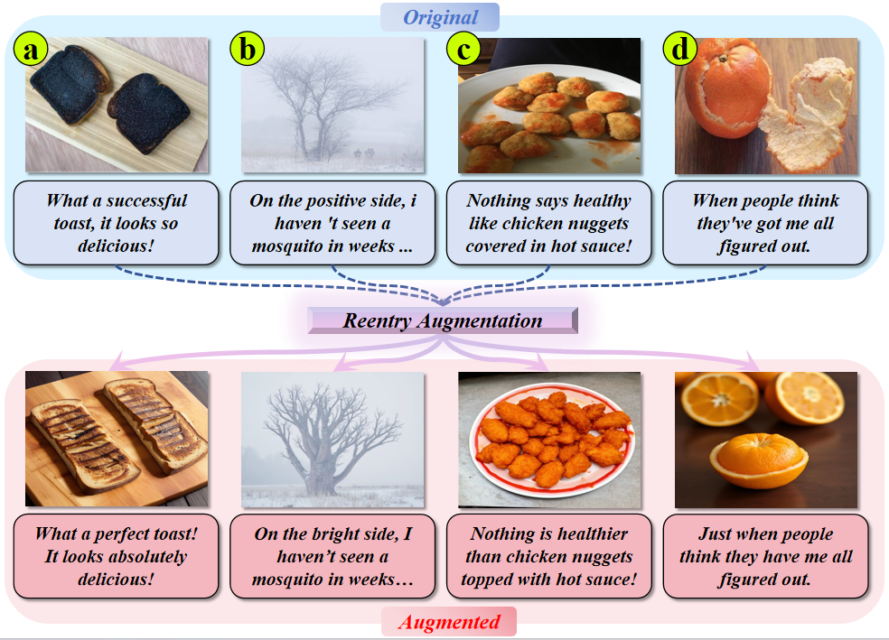

# 🤣👉Sarva👈

   

This repository is the official codebase of "**Sarva: Multimodal Sarcasm Detection via Multimodal Large Language Models Base on Bootstrapping Sarcastic Reasoning and Reentry Augmentation**"
 
In the following, we will guide you how to use this repository step by step.
## 🤣👌Introduction
To the best of our knowledge, we are the first to explore the sentiment reasoning capability of Large Vision-Language Models (LVMs) for the task of multimodal sarcasm detection, addressing the common challenges faced by current multimodal sarcasm detection models through MLLMs.

  

## 🤓 Overview

  

## 😅 Sentiment Instruction and Augmented Samples

  
  

To better aid MLLMs in performing complex emotional reasoning for understanding sarcastic semantics, we have designed three novel guidance strategies: **Chain of Emotional Contradiction (CoEC)**, **Graph of Emotional Contradiction (GoEC)**, and **Bagging of Emotional Contradiction (BoEC)**. These strategies are designed to prompt MLLMs to detect sarcasm in humans by incorporating both sequential and non-sequential prompting approaches. To further analyze the samples enhanced by the Reentry Augmentation module, we conduct a qualitative analysis of the generated augmented samples. Specifically, we select four examples to present both their original and augmented forms.

## 🤡 Quickstart

### Datasets Preparation
MMSD dataset--[link](https://github.com/soujanyaporia/MUStARD)	  
MMSD2.0 dataset--[link](https://github.com/JoeYing1019/MMSD2.0.git)  
MultiBully dataset--[link](https://github.com/ROC-HCI/UR-FUNNY?tab=readme-ov-file)  

